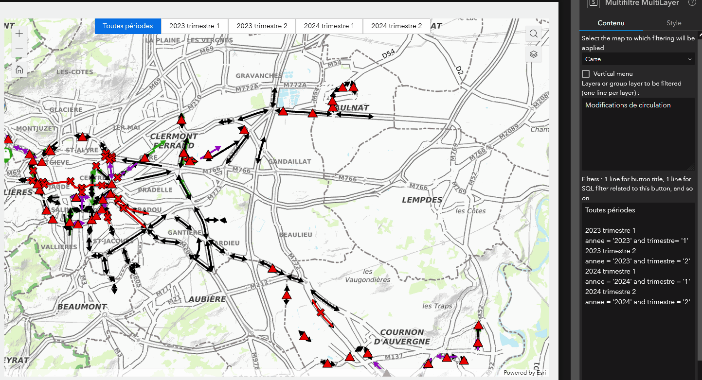

# A Widget for ExperienceBuilder for ArcGis
This widget add buttons for filtering data on several layers at once.
Each button is associated with an sql filter that will be applied to a list of layer.
You can also apply this filter to layers in a group of layer or in an image layer.

## Installation
Copy this directory in the widget folder of your Experience Builder client.
See : https://doc.arcgis.com/en/experience-builder/11.0/configure-widgets/add-custom-widgets.htm

## Configuration
The settings of the widget :
- Select a map to link to the widget
- Select one or more datasource layers that you want to be filtered
- Filters settings : two text lines per button, one for the displayed text of the button, and another for the sql filter that will be applied when you click on the button.
- Choose horizontal or vertical disposition for the buttons

## Example
